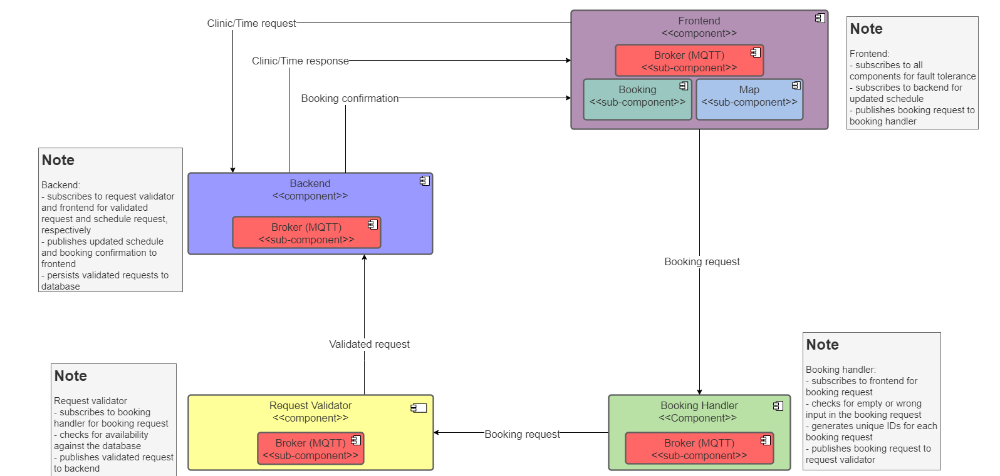

# Team-12 | Dentistimo - Frontend Component  

## Description

This component is responible for the following:

* Display the map for the user
* Handle the webpage that the user uses
* The design of the webpage

### Technologies

* Node.js
* MQTT
* Google map
* Vue

### Prerequisite 

* Add .env file with the environment variable for google map with the following format: 
 ``` VUE_APP_MAP_ACCESS_TOKEN=XXXXXXXXXXXXXXXXXXXXXXXXX ```

### Install

 In the clients folder:
1. ``` npm install ```
2. ``` npm install --save vue ```
3. ``` npm install --save vue-browser-geolocation vue2-google-maps ```

### Running the Frontend component

1. ``` npm run serve ```

## User Manual

### Steps to book an appointment:

1. After the page has finished loading, start a booking by pressing on the “CHOOSE A CLINIC!” button. You will then be taken to the next section of the page.

2. A map of Gothenburg will be shown where each clinic will be represented by a marker. Hover over the clinic to see opening hours, and click on a clinic to proceed with the booking at the clinic of your choice. You will then be taken to that clinic’s available schedule for the current week.

3. The available slots for the current week for the clinic you chose will be presented, and you can scroll up and down the slots to see what times are available later or earlier. You choose a time slot by clicking on it, and then confirm that time by pressing on the “CONFIRM” button.

4. You will then be requested to input your name and your phone number, and once you have done this you press on the “CONFIRM” button to make your appointment.

5. After sending the appointment you will be sent to the top of the page where a message will pop out on the screen. If the message says “Appointment could not be made” it means that the time slot you selected was not available and you should try to book another time. If the message says “Appointment was successfully booked” it means your appointment was booked correctly.

## Component Diagram



## About

### Development Team

* Gianmarco Iachella
* Jihan Phanivong
* Kamila Yosofi
* Kevin Ayad
* Markus Emilio Puerto Gutiérrez
* Markus Järveläinen

### Licensing

This repository additionally contains technologies and/or parts of code licensed under the following:
* MIT License
* EPL/EDL license
